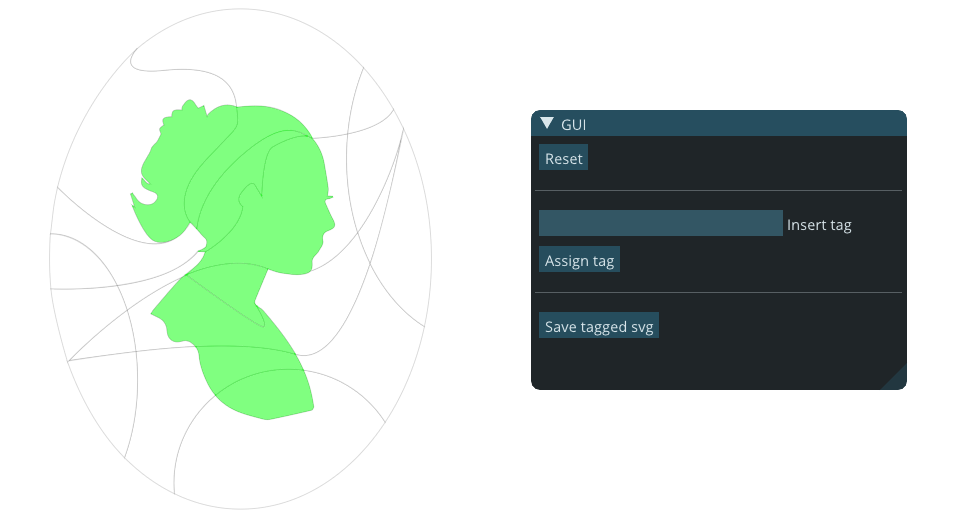
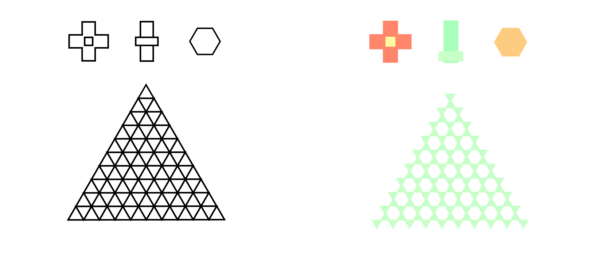
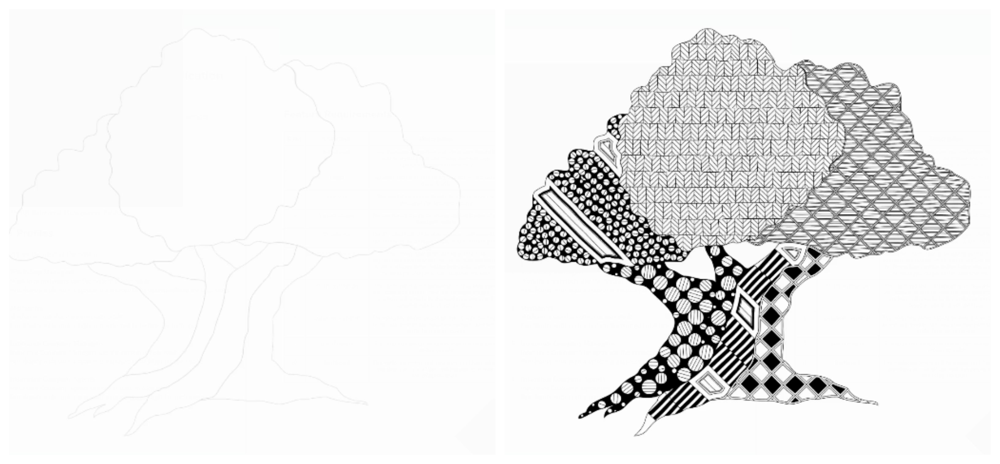
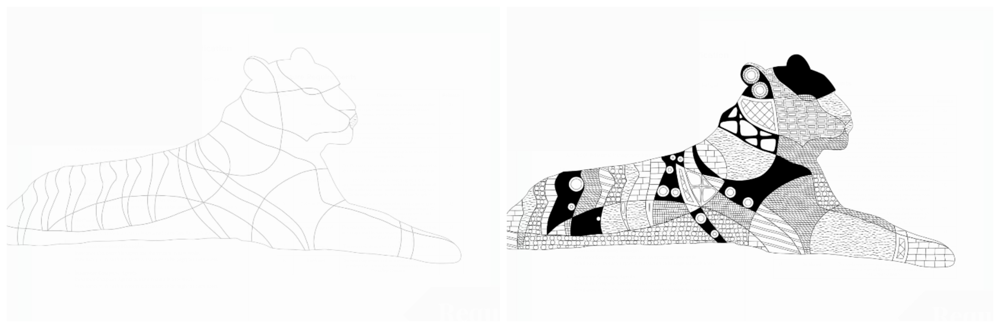

# gTangle


Implementation of the *SIGGRAPH 2016* paper [gTangle: A Grammar for the Procedural Generation of Tangle Patterns](documents/papers/gTangle.pdf) in `C++`


## Installation 

### `Ubuntu`
This project makes use of the OpenGL library GLFW. Most Linux distributions rely on the Mesa3D project to provide their OpenGL implementation. Hence, install Mesa, Make and GCC/g++ first and then the GLFW library. 

```
    > sudo apt-get install build-essential libgl1-mesa-dev cmake xorg-dev  
    > sudo apt-get build-dep glfw3
```

## Running The Code 
### `Tangle Generation`
The input SVG must be located in `code/resources/svg/`
The input grammar must be placed in `code/grammars/`
A `code/results/svg/` path must exist for the results to be generated.

To generate the tangle for the input SVG using a grammar,

```
> cd project-lab-team
> cd code
> make all
> ./main_timeline <SVG path relative to code diectory> <Grammar path relative to code directory>
```

A in detail timeline of the expansion of the grammar and the timestamps will begin printing on the screen. These lines of words may seem un-understandable but don't worry. Go to `code/results/svg` to see your tangle come to life across frames!

### `GUI`

To tag an SVG and give a customised input configuration the GUI can be used as follows,

```
> cd project-lab-team
> cd code
> make all
> ./main_tag_svg
```



## Controls

### `Left Click`
Select a closed curve in the SVG using a left click, assign a tag in the text box in the GUI window and watch the shapes with the same tag take a unique colour!

### `Right Click`
Undo *all* the currently selected shapes using the right click.

### `Numbers`
Use different number to open different SVGs present in the `code/resources/svg/` folder.

### Directory Structure

```
.
├── code
│   ├── external        <All external libraries used in the project>
│   ├── grammars        <Grammar taken as input by the project>
│   ├── gTangle         <All cpp files written for the project>
│   ├── imgui.ini       <Rendering dimensions for GUI window>
│   ├── Makefile
│   ├── resources       <fonts, pngs and svgs>
│   └── results         <Results in svg and png format>
├── documents
│   ├── files           <Proposal, guidelines and documentation>
│   ├── papers          <Paper and resources>
│   ├── presentations   <All slide decks>
│   └── supplemental    <Supplemental material for the paper>
├── operators           <Code for operators demo>
│   ├── external
│   ├── grammars
│   ├── Makefile
│   └── tinygrammar
└── README.md
```

### Results

All results can be found [here](https://drive.google.com/drive/folders/1dxK9alXp_40hhMJM8po3nLMhrIyCyVqi?usp=sharing) 
Here are some input SVGs and their corresponding tangles!






### Authors

[@Ammar PL](https://github.com/AmmarPL)

[@Aman Goel](https://github.com/Amangoel32)

[@Aryamaan Jain](https://github.com/aryamaanjain)

[@Jyoti Sunkara](https://github.com/JyotiSunkara)

### Documents 
- Project guidelines are [here](documents/files/guidelines.md)

- gTangle: A Grammar for the Procedural Generation of Tangle Patterns [Paper](documents/papers/gTangle.pdf)

- Proposal for the project timeline can be found [here](documents/files/proposal.md)

- Mid evaluations slides are [here](https://docs.google.com/presentation/d/17l0Tkhzg3QempJqMyVa7Vts7_oPK9UyUCqe227VFLWU/edit?usp=sharing)

- Final evaluation slides are [here](https://docs.google.com/presentation/d/1nMlc32xFEZRkJVcHyOrr4RdV7sxMAv6_RxtfERHP_U0/edit?usp=sharing)
